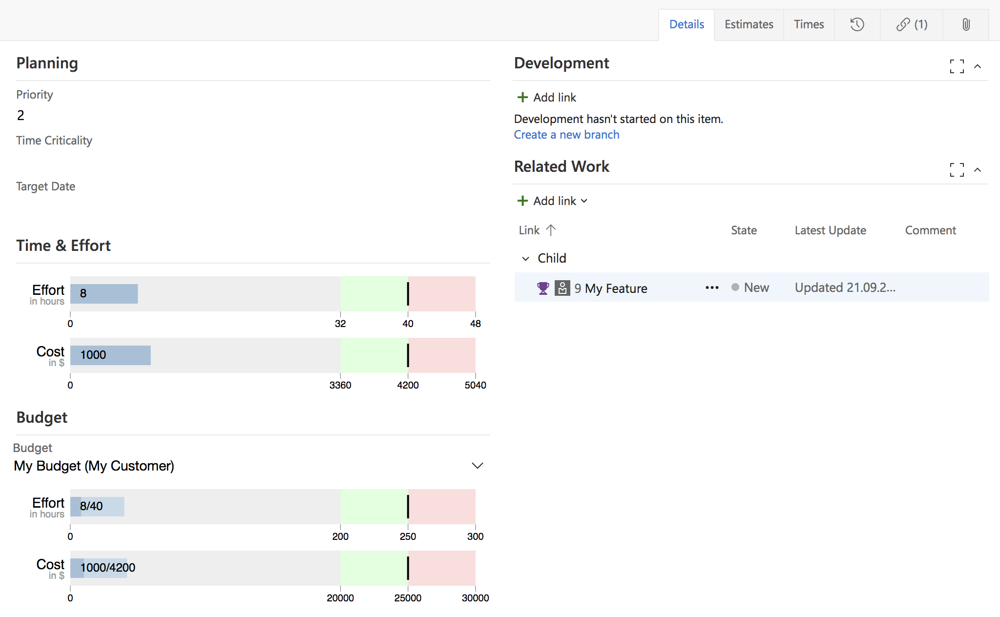
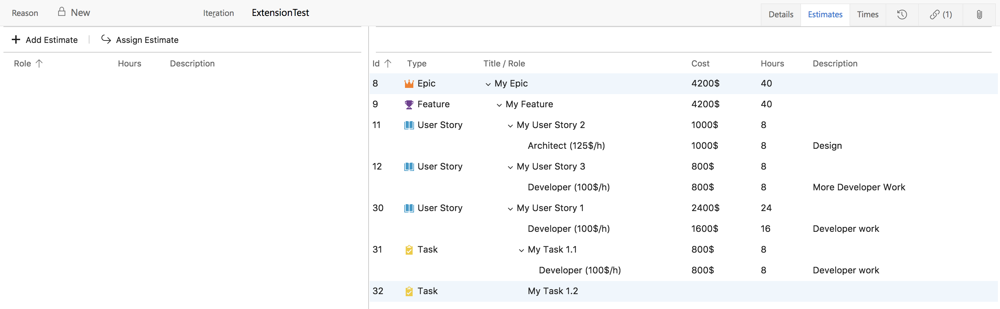
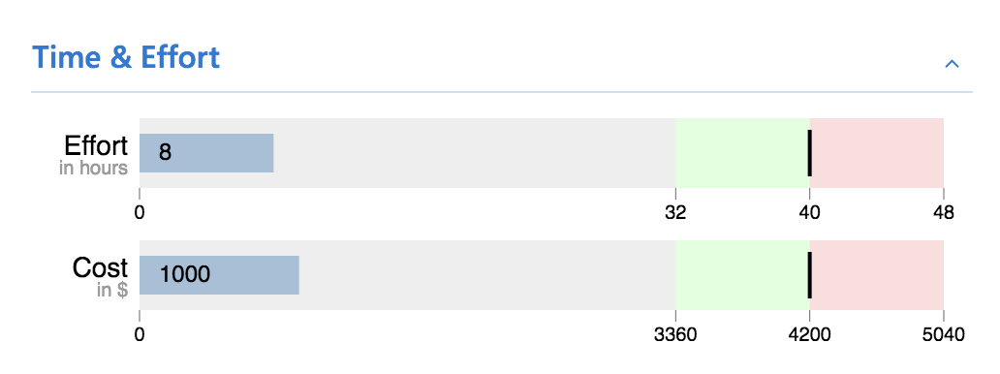
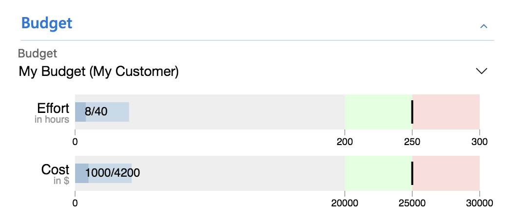
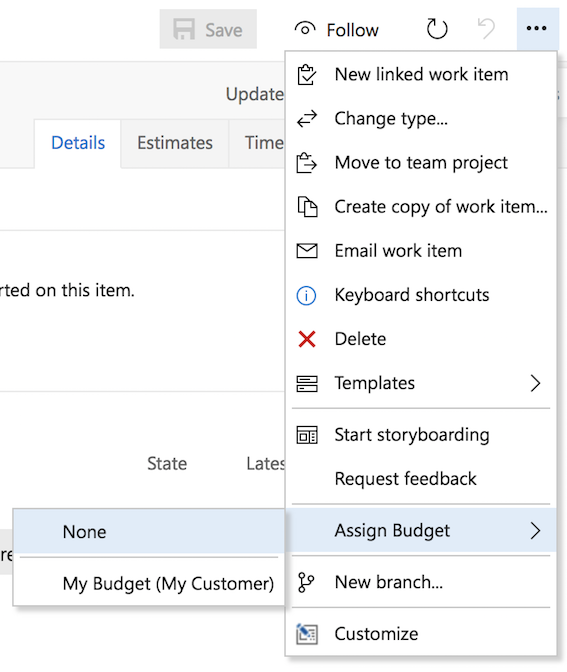
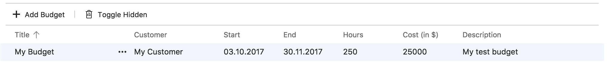
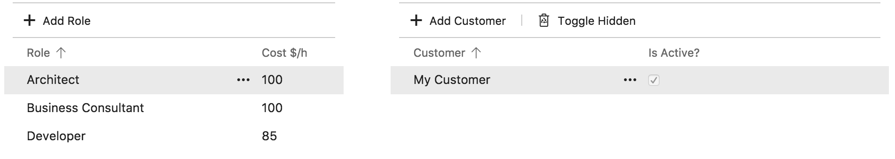
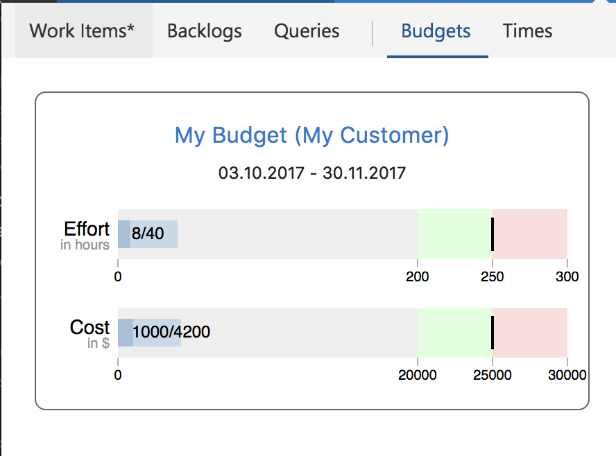

## Enable personal time tracking and budgets for smaller teams

Time & Effort is a free and simple open source extension. We use it internally for our projects and wanted to make it public as open source for everyone to use and improve.

This extension does not rely on any external services -- all data is stored in your VSTS account. We do not change any process settings.

## Track time and estimates on any Work Item

### Work Item form:

### Estimates tab (Times tab looks and works the exact same way):

* Left pane: entries for current item
* Right pane: entries for all children

## See aggregated time & cost data at a glance

### View estimated and used time on every work item:

Example: estimated 40hrs / used 8hrs

## Manage, assign & track budgets

### View current budget state or assign a budget on any item:

Example: Budget 250hrs -- 40hrs are estimated (=assigned) so far in items and 8hrs have been used

### Mass assign is supported via context menu

Will display a message box upon completion if more than 4 items were selected.

### Auto assign budget

New items will be assigned to the same budget as their parent.

## Configure roles, costs, and budgets

### Edit data on a separate Settings hub:

* Customers are used for budgets
* Roles are global
* Hourly rates for roles can be overridden per budget

## Reporting

### 'Times' hub
* grouped by Budget
* grouped by Person
* adjust time filter (default is current month)
* simple Excel export

### 'Budgets' hub

A tile containing bullet graphs and a link to an auto-generated query for each budget

## Known limitations

* [Auto generated queries can not be customized yet](https://github.com/Cape-Code/vsts-time-and-effort/issues/6)
* [Only people with admin access in your team can currently use this extension](https://github.com/Cape-Code/vsts-time-and-effort/issues/5)
* Tech-savvy people with access to your VSTS account can easily read all data stored by this extension using the extension data service provided by Microsoft.
    * To avoid this we would have to store all data in Work Items including extensive process customization, which is too much work and not our goal
* There is no undo!
* We implemented and used an importer for our existing time tracking data (from fields in Tasks) in an older project we migrated from an on-premise TFS instance, but it is disabled in this release -- check `Settings/TimesImportHub.ts` or contact us for help

## Development

* Developing and testing extensions for VSTS is challenging, because the provided documentation is incomplete and not 100% up-to-date
* Created with [Visual Studio Code](https://code.visualstudio.com)
